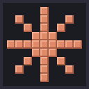
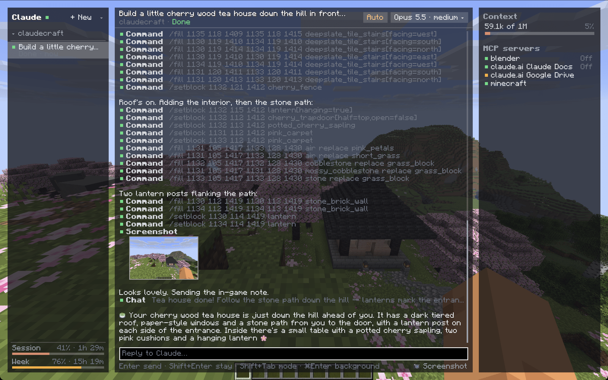
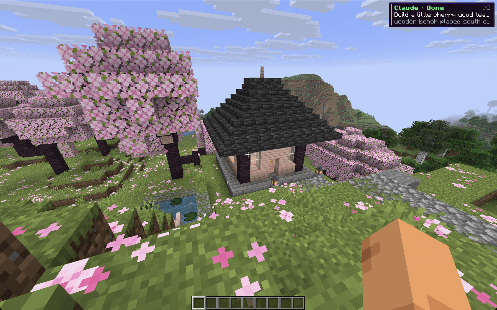
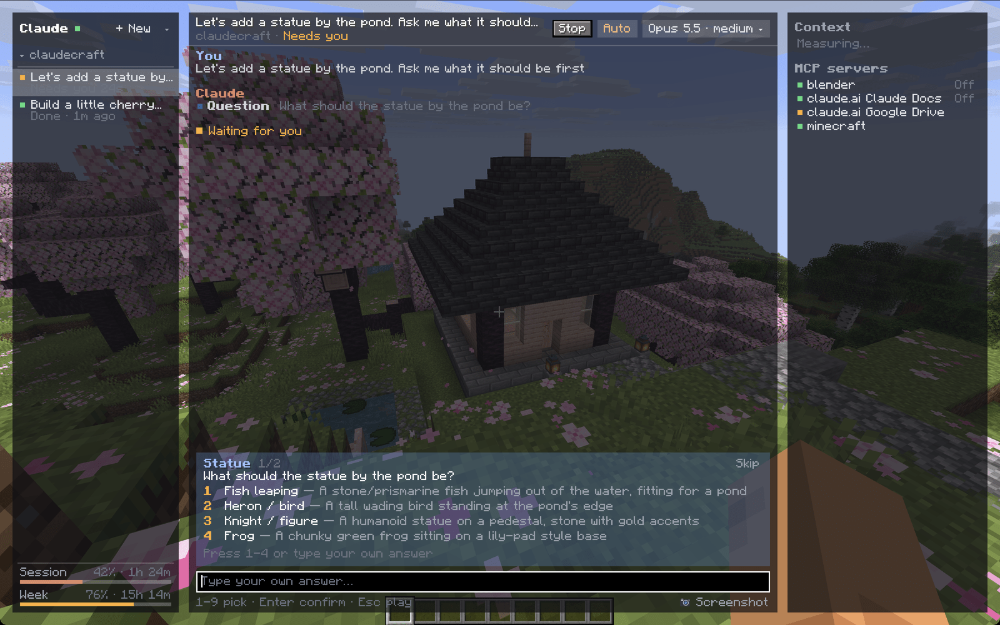

<div align="center">



# ClaudeCraft

**Claude Code inside Minecraft.** Chat with Claude from an in-game panel while you play, and let it see and build in your world.

[](#supported-versions)
[](#supported-versions)
[](https://claude.com/code)



</div>

## Features

- **Real Claude Code sessions.** Threads are grouped by project folder (worktrees included) and can be resumed in the terminal.
- **A Minecraft-styled panel** with streaming Markdown and emoji, tool calls, subagent progress, plan cards, todos and image thumbnails. A side panel shows context, todos, background tasks and MCP servers.
- **Minecraft tools for Claude:** `status`, `run_command`, `read_blocks`, `nearby_entities`, `screenshot` and `say`.
- **Approvals and questions in game.** Permission modes, plan approval and Claude's questions all work without leaving the game.
- **Image input.** Paste from the clipboard or attach a screenshot of your view.
- **Model picker** with effort levels, the Claude Code version, a binary chooser and a one-click update.
- **Background sessions** (`claude --bg`) that keep building after you quit, plus a HUD pill, toasts and note-block pings when Claude finishes or needs you.
- **Local MCP server,** so Claude Desktop or a terminal Claude Code session can drive the game too.

<table>
  <tr>
    <td width="50%"></td>
    <td width="50%"></td>
  </tr>
  <tr>
    <td align="center">Close the panel and keep playing; a toast tells you when Claude is done.</td>
    <td align="center">Answer Claude's questions with the number keys.</td>
  </tr>
</table>

## Getting started

1. Install [Claude Code](https://claude.com/code) and log in (`claude` should work in a terminal).
2. Drop the ClaudeCraft jar for your version into `mods`, together with Fabric API (Fabric) or Legacy Fabric API (Legacy Fabric).
3. Press <kbd>`</kbd> in game and ask Claude to build something.

## Controls

| Key | Action |
| --- | --- |
| <kbd>`</kbd> | Open or close the panel (rebind under Controls → ClaudeCraft) |
| <kbd>Enter</kbd> / <kbd>Shift</kbd>+<kbd>Enter</kbd> | Send and return to the game / send and keep the panel open |
| <kbd>⌘</kbd>/<kbd>Ctrl</kbd>+<kbd>Enter</kbd> | Send as a background session |
| <kbd>Alt</kbd>+<kbd>Enter</kbd> | New line |
| <kbd>Shift</kbd>+<kbd>Tab</kbd> | Cycle permission mode |
| <kbd>⌘</kbd>/<kbd>Ctrl</kbd>+<kbd>V</kbd> | Paste text, or an image from the clipboard |
| <kbd>Y</kbd> / <kbd>A</kbd> / <kbd>N</kbd> | Allow / always allow / deny (plans: approve / auto-accept edits / keep planning) |
| <kbd>1</kbd>–<kbd>9</kbd> | Pick an answer to Claude's question |
| <kbd>Ctrl</kbd>+<kbd>B</kbd> | Move running Bash commands and subagents to the background |
| <kbd>Ctrl</kbd>+<kbd>C</kbd> (macOS) or Stop | Stop Claude |
| Right-click a thread | Rename, fork, archive, delete, background |

Type anything else to decline a pending action with feedback instead.

**Commands:** `/clear`, `/rename <title>`, `/fork`, `/compact [instructions]`, `/background <prompt>`, `/effort <auto|low|medium|high|xhigh|max>`, `/screenshot`, `/worktree` and `/archive`. Other `/` commands go to Claude Code.

Settings live in `config/claudecraft.json`: `claudePath`, `workspace`, `model`, `effort`, `permissionMode`, `mcpServer`, `mcpPort`, `sounds`, `toasts` and `archived`.

## Connect Claude Code or Claude Desktop

While the game runs, ClaudeCraft serves its tools at `http://127.0.0.1:25595/mcp`:

```bash
claude mcp add --transport http --scope user minecraft http://127.0.0.1:25595/mcp
```

Claude Desktop only speaks stdio, so point it at the bridge in the mod jar (`claude_desktop_config.json`):

```json
{
  "mcpServers": {
    "minecraft": {
      "command": "java",
      "args": ["-cp", "/path/to/claudecraft-fabric-0.2.0+26.2.jar", "dev.claudecraft.agent.mcp.McpStdioBridge"]
    }
  }
}
```

## Supported versions

| Loader | Minecraft |
| --- | --- |
| Fabric | 1.16.5, 1.17.1, 1.18.2, 1.19.2, 1.19.4, 1.20.1, 1.20.4, 1.20.6, 1.21.1, 1.21.4, 1.21.5, 1.21.8, 1.21.10, 1.21.11, 26.1.2, 26.2, 26.3 |
| NeoForge | 1.20.6, 1.21.1, 1.21.4, 1.21.5, 1.21.8, 1.21.10, 1.21.11, 26.1.2, 26.2, 26.3 |
| Forge | 1.8.9, 1.12.2, 1.18.2, 1.19.2, 1.20.1 |
| Legacy Fabric | 1.8.9, 1.12.2 |

Each jar also covers neighbouring patch versions (for example, the 1.21.8 jar runs on 1.21.6–1.21.8).

## Building

```bash
./gradlew build                              # all modern jars
./gradlew -p legacy build                    # 1.8.9 and 1.12.2 jars
./gradlew :platform:26.2-fabric:runClient    # dev client
./gradlew :platform:26.2-fabric:prism        # Prism Launcher instance with the mod
./gradlew emojiAtlas                         # regenerate the committed Twemoji atlas
./gradlew test -Dclaudecraft.live=true       # also run the live tests against your Claude Code
```

Gradle needs JDK 25+; toolchains for older Java versions are provisioned automatically.

| Module | Contents |
| --- | --- |
| `agent/api` | Connector-agnostic agent API (Java 8, no dependencies) |
| `agent/mcp` | MCP server (in-process and streamable HTTP) and the stdio bridge |
| `agent/claude-code` | Claude Code connector (`claude` CLI and SDK control protocol) |
| `core` | Minecraft-agnostic app: chats, UI toolkit, panel, HUD, emoji and Minecraft tools |
| `platform` | Stonecutter tree for 1.16.5–26.3: Fabric, NeoForge, Forge |
| `legacy` | Stonecutter tree for 1.8.9 and 1.12.2: Forge, Legacy Fabric |
| `build-logic` | Shared Gradle plugins, the Prism task and the emoji atlas generator |

New AI backends implement `dev.claudecraft.agent.Connector`; the UI and tools stay unchanged.

## Credits

Inspired by [t3craft](https://github.com/maxwellyoung/t3craft). Emoji graphics are [Twemoji](https://github.com/jdecked/twemoji) by Twitter, Inc. and other contributors, licensed under [CC-BY 4.0](https://creativecommons.org/licenses/by/4.0/). The atlas in `core/src/main/resources/assets/claudecraft/emoji` is downscaled from Twemoji 17.0.3; its license ships next to it.
